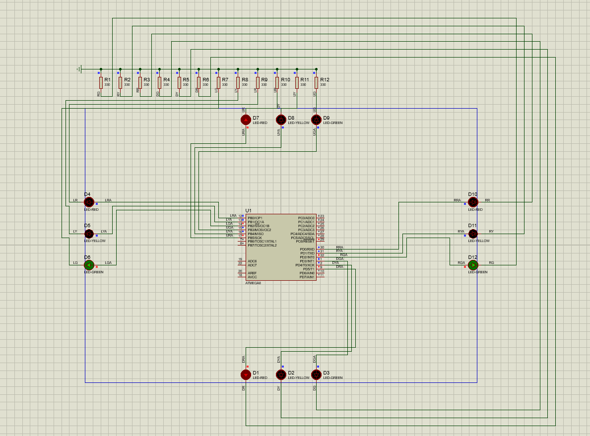

# AVR Simple Traffic Light

This project simulates a simple traffic light using an ATmega8 microcontroller. The program controls the red, yellow, and green lights with timing sequences to simulate a traffic light pattern. The microcontroller operates with an 8 MHz clock, and the program runs in a continuous loop.

## Screenshot

## Features
- **Three traffic light states**: Red, Yellow (blinking), and Green.
- **Timing control**: The green light is on for 12 seconds, followed by a blinking yellow for 3 seconds, and then the red light is turned on for 12 seconds, followed by another yellow blinking cycle.
- **Port configuration**: The program uses specific microcontroller ports for controlling the lights:
  - **Port B**: Used for controlling the red and green lights.
  - **Port D**: Used for controlling the yellow lights and other signal logic.
  - **Timer setup**: The project sets up timers, but they are not used in the basic traffic light pattern.
  
## Hardware Requirements
- **ATmega8 microcontroller**
- **LEDs** for red, yellow, and green lights
- **Resistors** for current limiting

## Software Requirements
- **AVR-GCC** or similar toolchain for compiling C code for AVR microcontrollers
- **CodeWizardAVR** or any similar automatic code generator for AVR programming
- **Proteus** (Optional)

## Setup
1. Set up the ATmega8 microcontroller on a breadboard or PCB.
2. Connect LEDs to the appropriate pins (Port B and Port D) with current-limiting resistors.
3. Compile and upload the code to the ATmega8 using your preferred programmer (e.g., USBasp).
4. Observe the LED sequence that simulates a traffic light.

## Code Overview
### Port Setup
- **Port B**: Controls red and green lights.
  - `PORTB.0`, `PORTB.3`, `PORTB.4`, `PORTB.5` are used for various lights.
- **Port D**: Controls the yellow lights.
  - `PORTD.0`, `PORTD.1`, `PORTD.2`, `PORTD.3`, `PORTD.4`, and `PORTD.5` are used for controlling the lights.
  
### Timing
- **Green light**: On for 12 seconds.
- **Yellow blinking**: 3 cycles of 500ms blink before switching to the red light.
- **Red light**: On for 12 seconds.

### Infinite Loop
The program runs continuously, cycling through the red, yellow, and green lights indefinitely with the appropriate delays for each.

## Author
- Created by [Mohammd H. Moazzen](https://github.com/TirdadMH) 
- Date: April 28, 2023
